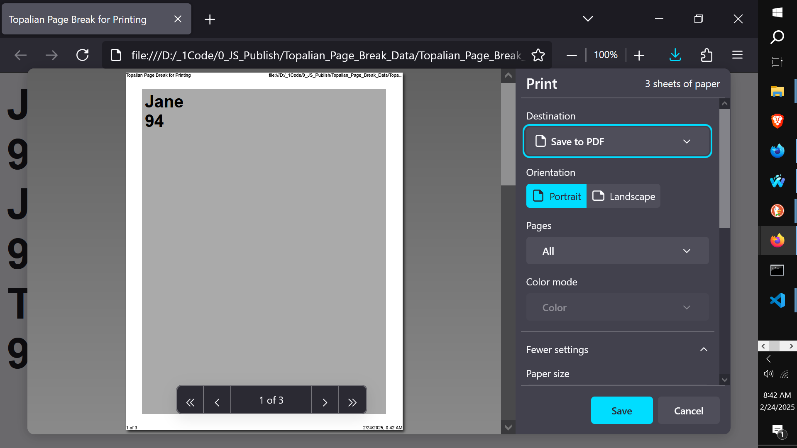
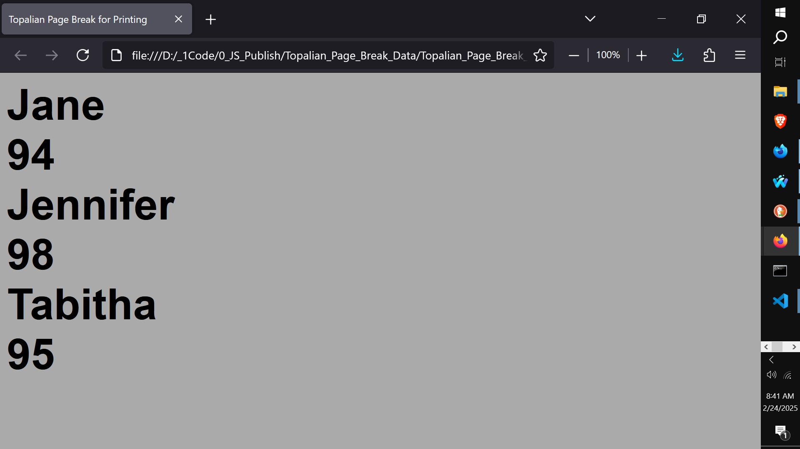
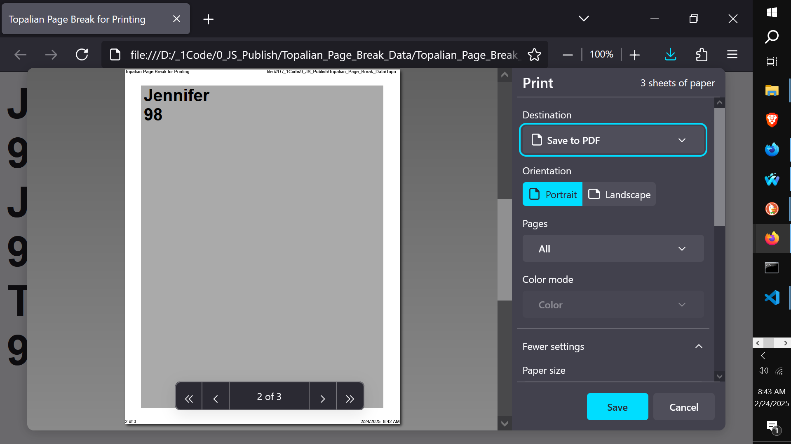
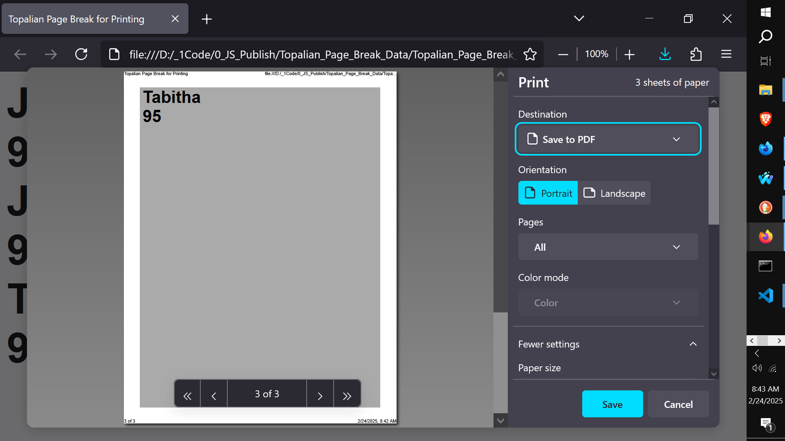
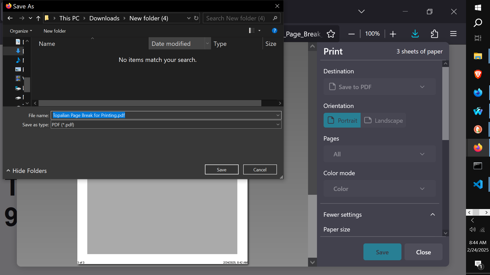
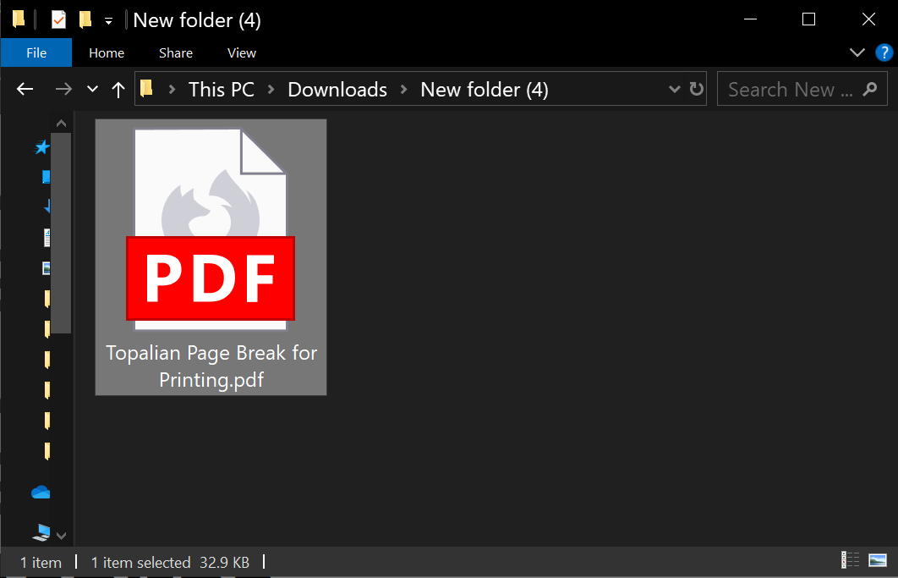
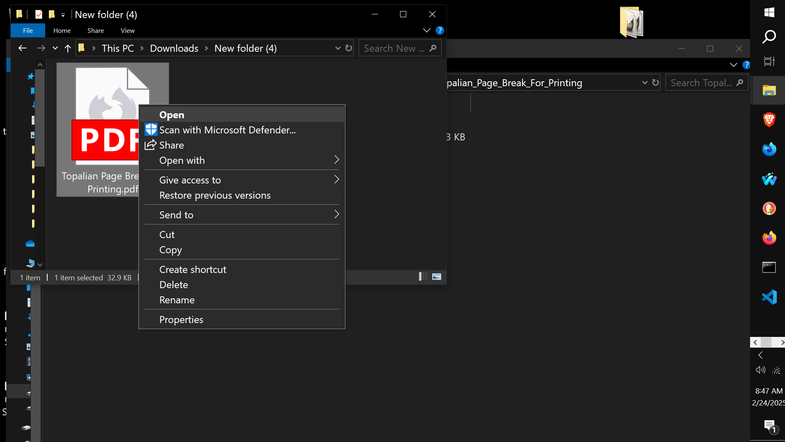
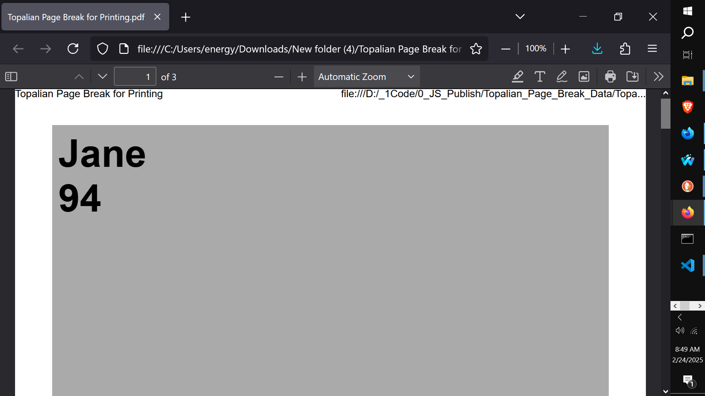
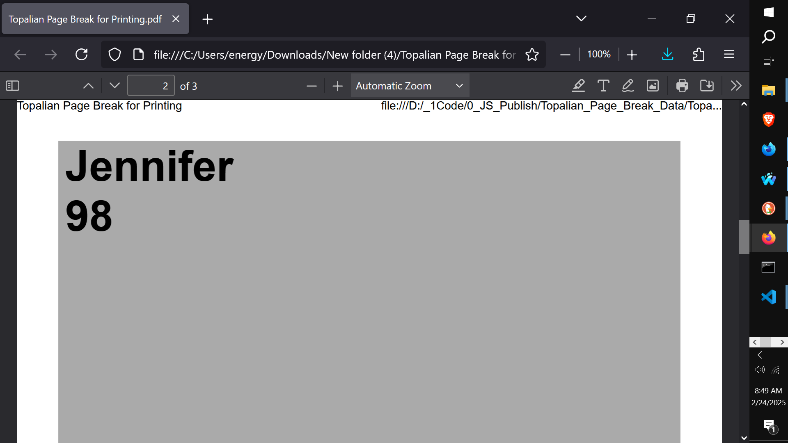

# CATopalian JavaScript Page Break for Printing and Book Making
This JavaScript application shows how to place each entry of an array at the top of each page for Printing and PDF Book Making.

  

When Using the App link below, Control + P to print to see each object entry on its own page.  

USE APP: https://christopherandrewtopalian.github.io/CATopalian_JavaScript_Page_Break_for_Printing_and_Book_Making/CATopalian_JavaScript_Page_Break_for_Printing_and_Book_Making.html

Video: https://www.youtube.com/watch?v=AzobWNlYXs0

CODE: https://github.com/ChristopherAndrewTopalian/CATopalian_JavaScript_Page_Break_for_Printing_and_Book_Making

---

### How to Download this App
1. **Click** the green **Code Button** on this github page
2. Choose **Download ZIP**
3. **Save** the **Zip File**
4. **Extract All**
5. **Double click** the **HTML file** to start the App

---

Happy Scripting :-)

---

// Dedicated to God the Father  
// All Rights Reserved Christopher Andrew Topalian Copyright 2000-2026  
// https://github.com/ChristopherTopalian  
// https://github.com/ChristopherAndrewTopalian  
// https://sites.google.com/view/CollegeOfScripting

